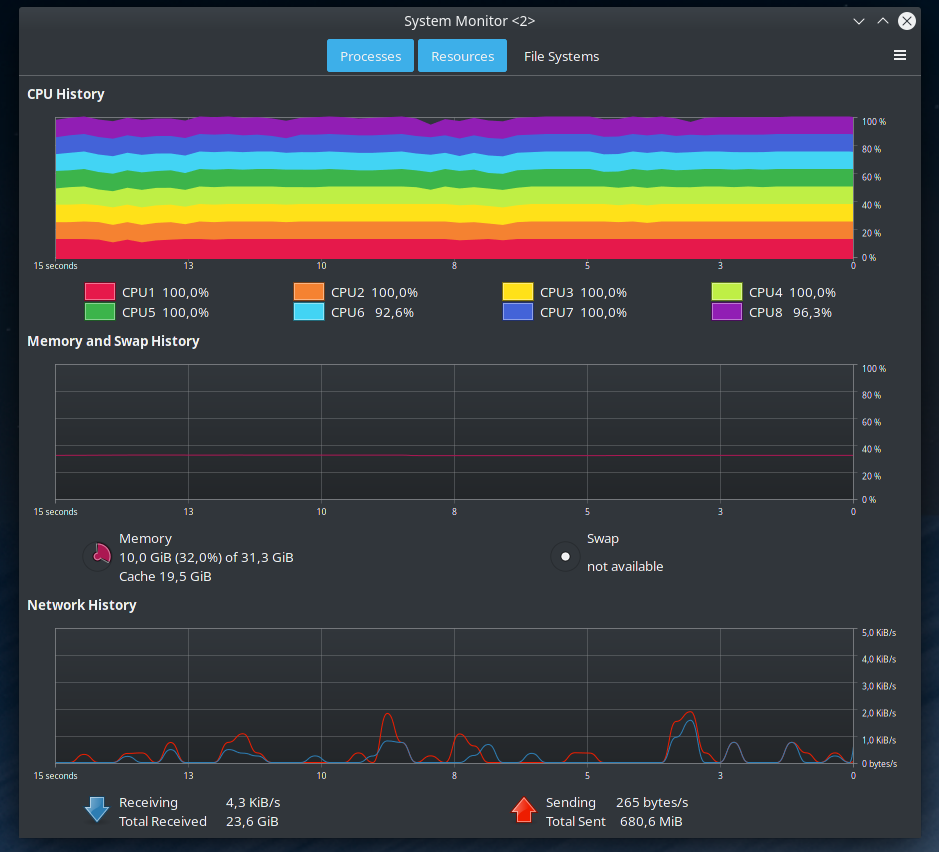
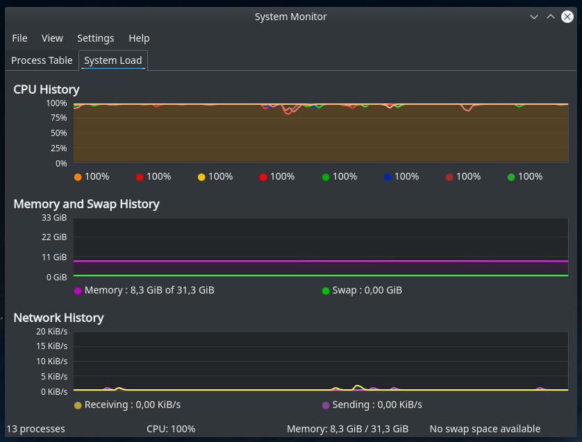
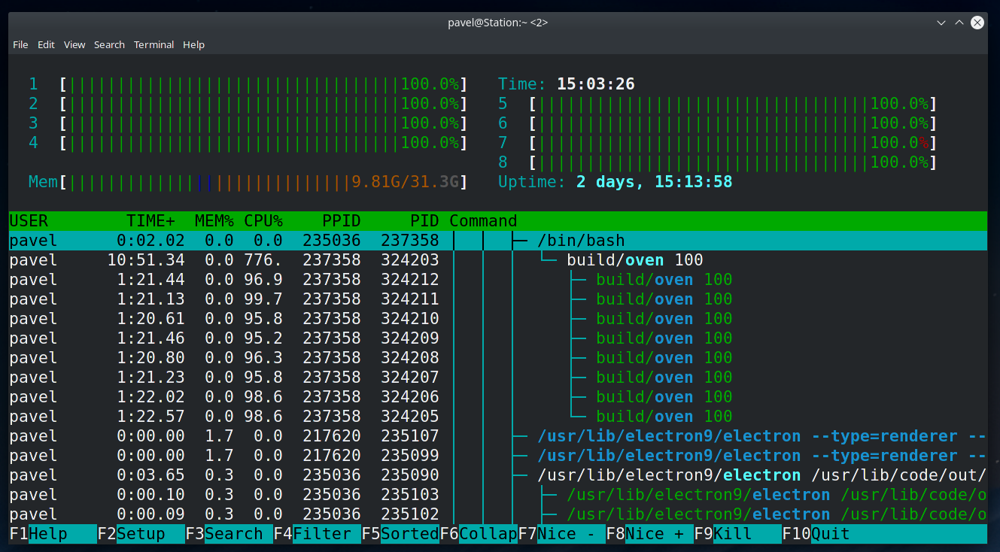

# Oven


Transform your laptop into portable oven without spending money on actually oven.

## Features
- Cross platform
- Adjustable heat output
- Uses all cores





## Compile from source
```bash
git clone https://github.com/pavelnoen94/oven.git
cd oven
make -j$(nproc)
# execute with 50% load:
build/oven 50
# install:
sudo make install
# uninstall:
sudo make uninstall
```

## Local development
for debian based systems
```bash
sudo apt install -y git make doxygen
```
for arch based systems
```bash
sudo pacman -S git git doxygen 
```
for Windows
- [Install git for windows](https://gitforwindows.org/)
- [Install make for windows](http://gnuwin32.sourceforge.net/packages/make.htm)
- [Install doxygen for windows](https://sourceforge.net/projects/doxygen/) For documentation only
